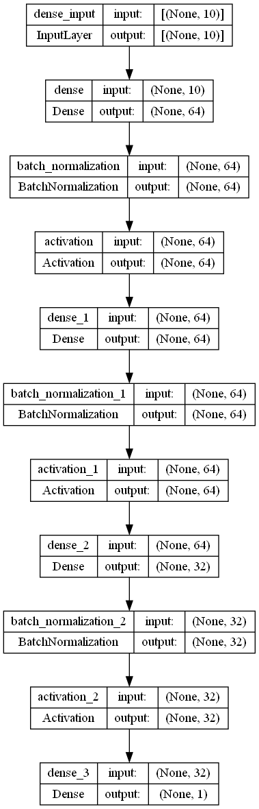

# Tetris

snowycornさんのプログラムをお借りして、対戦用環境で学習できるようにしています
Deep-Q-Networkを使用した深層強化学習をしています

Original DQN


Original Hold Mode DQN


対戦環境でのテトリスAI同士の対決


ネットワーク構造



## How it works

### 強化学習

強化学習は、ある「状態」が与えられたときに、どのような「行動」をとれば「報酬」が最大になるかを判断するために用いられます。

#### 状態

| 名前  | 説明 |
| ---: | :--- |
| 穴  | フィールドにある穴の数  |
| 設置高度  | テトリミノが設置された高さ  |
| 行遷移  | 水平方向のセル遷移の数  |
| 列遷移  | 垂直方向のセル遷移の数  |
| 累積井戸  | すべての井戸の深さの合計  |
| 凸凹 | 各列の高さの差の合計  |
| 高さ合計  | 各列の高さの合計  |
| 消去ライン数 | 一度に消去したライン数  |
| 消去ブロック数  | 消去ライン数 × 10  |

#### 報酬

報酬は基本的なテトリスのスコアと同じくらいの比率で与えています。プレイヤーが生き続ける限り報酬を与え、負けると報酬が減ります。

| 名前  | 報酬 |
| ---: | :---: |
| 生存  | +1  |
| シングル  | +40  |
| ダブル  | +100  |
| トリプル  | +300  |
| テトリス  | +1200  |
| REN(1~2)  | +10  |
| REN(3~4)  | +20  |
| REN(5~6)  | +30  |
| REN(7~9)  | +40  |
| REN(10~)  | +1500  |
| ゲームオーバー  | -5  |

#### 行動

<以下原文翻訳>

前述したように、可能性のあるすべての状態を比較して、最も高い報酬を得られるものを見つけます。
最良の盤面状態をもたら行動が選択されることになる。
行動は、回転数（0〜3）と、ブロックが落ちるべき列（0〜9）のタプルである。

### Q-Learning

<以下原文翻訳>

Q-Learningを使用しなかった場合、ニューラルネットワークは将来の報酬よりも即時の報酬を得ることを好むでしょう。
この場合、たとえ障害物ができてゲームの続きが面倒になったとしても、プレイヤーは1列を消去したいと思うでしょう。
だから、Q-Learningを使うことが重要なのです。


<解釈>
Q-Learningを使うことで将来の報酬を高めるようにするため、ゲームオーバーになりにくくなる。

### Training

<以下原文翻訳>

最初は、AIがランダムに行動を選択して探索します。
エピソードごとに、過去のゲームからランダムに選んだ経験（Q-Learningも適用）を使って自己訓練します。
徐々に、探索型から探索型に移行し、ニューラルネットワークが行動を選択するようになります。

## 実行方法

### 仮想環境の作成

Python3の標準ライブラリであるvenvで仮想環境を作成する

Tetris_DQN_VSversion_jpのディレクトリ内で以下のコマンドを入力してください。

```ps1
python -m venv .venv
```

`.venv`のところは好きな文字列でもいいです。

### 仮想環境への切り替え

### コマンドプロンプト

作成した仮想環境 .venv ディレクトリにある Scripts\activate.bat を実行します

```cmd
.venv\Scripts\activate.bat
```

### PowerShell

仮想環境を利用する前に、PowerShellでスクリプトの実行を許可しておきます。PowerShellを起動し、次のコマンドを実行します。

```ps1
Set-ExecutionPolicy RemoteSigned -Scope CurrentUser -Force
```

このコマンドは、一番最初に一回だけ実行してください。2回目以降は不要です。

この設定がない場合、つぎのようなエラーが発生する場合があります。

```ps1
.\.venv\Scripts\Activate.ps1 : このシステムではスクリプトの実行が無効になっているため、
ファイル C:\Users\Tetris_DQN_VSversion_jp\.venv\Scripts\Activate.ps1 を読み込むことができません。
詳細については、「about_Execution_Policies」(https://go.microsoft.com/fwlink/?LinkID=135170)
を参照してください。
発生場所 行:1 文字:1
+ .\venv\Scripts\Activate.ps1
+ ~~~~~~
    + CategoryInfo          : セキュリティ エラー: (: ) []、PSSecurityException
    + FullyQualifiedErrorId : UnauthorizedAccess
```

次に、作成した仮想環境 .venv ディレクトリにある Scripts\activate.ps1 を実行します。

```ps1
.venv\Scripts\activate.ps1
```

コマンド プロンプトの先頭に (.venv) と表示され、仮想環境で実行中であることを示します。

### モジュールのインストール

仮想環境を使用中にpipを使って必要なパッケージなどをインストールします。

```ps1
python -m pip install -r requirements.txt
```

必要なパッケージなどはrequirements.txtに記載をしていますが、抜けがあるかもしれません。

バージョン指定しているものはそのバージョンで動かすことをお勧めします。しかし、公式からは推奨されていることではないので、プログラムを大幅に変更することができる方は最新バージョンに合わせたプログラムの書き方に変更して使用していただけるとよろしいかと思います。

### 実行

実行したいファイルを指定して実行します。

```ps1
python run_play.py
```

snowycornさんのブランチにある一部pythonファイルは自分のプロジェクトでは使わなかったので削除しています。

**学習させたモデルは大変申し訳ないのですが、実装の都合上`Tetris_DQN_VSversion_jp`ディレクトリ直下と`Tetris_DQN_VSversion_jp/gym_tetris/envs`ディレクトリのそれぞれにいれてください。`Tetris_DQN_VSversion_jp/gym_tetris/envs`内に学習モデルがないと対戦ができません。**

#### テストプレイ

`run_play.py`を実行すると学習させたモデルを動かすことができます。
初期状態ではモデルCを１人プレイ用の環境で動かします。

対戦用に切り替える場合は [`tetris_env.py`](gym_tetris/envs/tetris_env.py) ファイル内のコメントアウトしているコードをアンコメントしてください。
説明用のコメントアウトもありますので、お手数ですが、ご自身で見て判断お願いいたします。

また、アンコメントすると[`tetris_env.py`](gym_tetris/envs/tetris_env.py) ファイル内のrender関数でdraw()が二つ呼ばれてしまいますので、１人用の場合は`self.view.draw(self.game)`だけアンコメントし、対戦用の場合は`self.view.draw(self.game, self.enemy_env.game)`だけアンコメントしてください。

#### 学習

`train_game.py`を実行すると指定したファイル名でモデルを学習させることができます。

１人用か対戦用かは前述した[`tetris_env.py`](gym_tetris/envs/tetris_env.py) ファイルの内容によります。

詳しいことについては[`train_game.py`](train_game.py)内のコメントアウトで記載しています。

学習ステップ数やモデルの保存する際の名前などを変更できるようにしています。

### 仮想環境の終了

仮想環境の使用を終え、通常の状態に復帰するときは、`deactivate`コマンドを実行します。

```ps1
deactivate
```

## 補足

DQNの実装については[`DQN.py`](gym_tetris/ai/DQN.py)で確認できます。ネットワーク構造もここで変更可能です。

テトリスの回転や盤面管理については[`game.py`](gym_tetris/game.py)で確認できます。

点数計算や火力計算については[`board.py`](gym_tetris/board.py)で確認できます。

テトリスの描画については[`view.py`](gym_tetris/view.py)で確認できます。

## リンク

Explanations for statistics

[Building Controllers for Tetris](https://pdfs.semanticscholar.org/e6b0/a3513e8ad6e08e9000ca2327537ac44c1c5c.pdf)

[Tetris Agent Optimization Using Harmony Search Algorithm](https://hal.inria.fr/inria-00418954/file/article.pdf)
